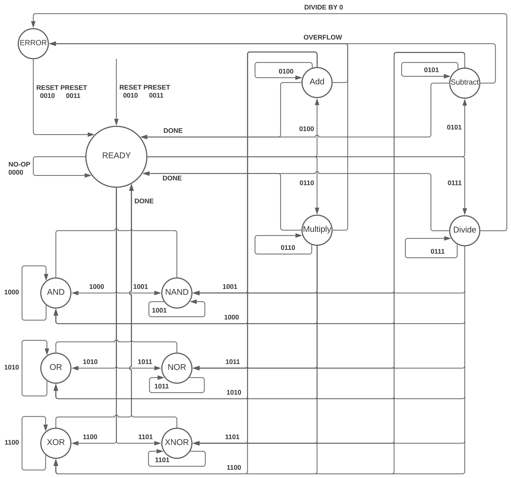
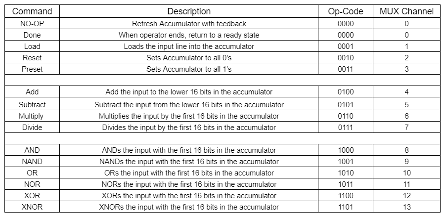
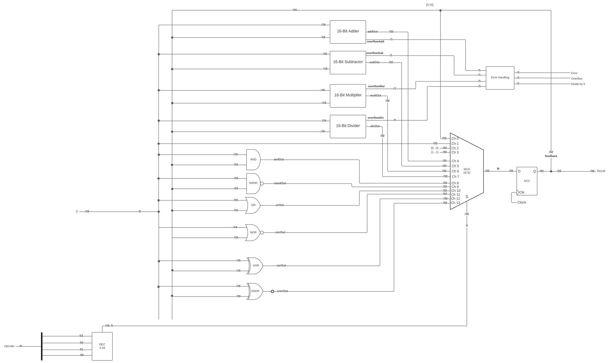

# Semester Project - Arithmetic Logic Unit (ALU)
By: Cameron Cook, Jonathan Hocevar, Jonathan Schroeter  
Cohort: Burrito

## Overview
Our ALU takes in a 16-bit Dataline and a 4-bit Op-Code line to control the operations on the data in the circuit. The output of the chosen operation is stored in a 32-bit accumulator that is refreshed on the positve edge of a clock. The 32-bit output of this accumulator is the main output of the ALU. The lower 16-bits of this accumulator is fd back as the second input to each of the modules/operations of the ALU. We also output a 3-bit error code to represent the status of the output. The last bit represents a divide-by-zero error and that the resulting output of the ALU is undefined. The next bit represents that there was an overflow of either Addition, Subtraction, or Multiplication and that more than the lower 16 bits are needed for the full output. The first bit simply represents that one of the other two error bits has been flagged. This allows for quick checking for a specific error, or any error in general.

## State Machine
The flow of our ALU can be described by the state machine below. On a clock pulse (rising edge) the state machine moves from ready to the state determined by the current Op-Code. Once the operation is complete, the state returns to the ready state.

## OP-Codes. 
The table below shows the valid op-codes for our ALU and their functions

The op-codes are divided into 3 different prefixes based on their outputs.
Prefix 00 represents a control operation
Prefix 01 represents a Mathematical operation
Prefix 1  represents a Gate operation
Additionally, with gate operations, a 1 as the last bit represents its inverted form (NAND, NOR, XNOR).

Control operations include the following
- NO-OP  -> The accumulator is simply refreshed to maintain the data
- Load   -> Sets the accumulator value to that of the data input line
- Reset  -> Sets the accumulator to all 0s
- Preset -> Sets the accumulator to all 1s

The op-codes are fed into a 4:16 bit decoder that then feeds a 16-bit 1 hot bus into a 16 input multiplexer. The table above shows the mux channel for each op-code (simply the decimal of the binary value of the op-code). 

## Circuit Diagram
Below is the circuit diagram of the ALU showing each module and component wired together. Below that will be a secion describing each module and a parts list for all the parts used to build it.

## Modules
#### Mathematical Modules
There are 4 mathematical modules, and 6 gates as operations in our implementation
- Addition
- Subtraction
- Multiplication
- Division  
Each of the modules handles bots its inputs and outputs in two's complement, so the input range accordingly is −32,768 to 32,767 on each of their 2 16-bit inputs. The modules each output a 32 bit number, so any result possible will be fully displayed. If the result of addition, subtraction, or division requires use of the higher 16 bits, the overflow output is also set to 1, else it is set to 0. On division, the overflow is only set to 1 if the second input channel is 0 to represent a divide-by-zero error.

#### Gate Modules
Our ALU also includes 3 of the standard 2 input gates with their complements.
- AND/NAND
- OR/NOR
- XOR/XNOR
Each one is a separate modules (for a total of 6) that takes 2 16-bit inputs and outputs a 32-bit input with the upper 16 bits being 0 and the lower 16 bits being the output of the gate operation on the two inputs. There are no error messages for the gate operations. 

#### Control Modules
- 16 32-bit input multiplexer with a 16-bit 1-hot selector bus
- 4:16-bit decoder to decode the opcode and feed into the multiplexer
- Error control module to take in 4 error codes and output the 3-bit error code

## Parts List
### Wires
#### Inputs
- OP is the 4-bit opcode command bus  
- D is the 16-bit data input bus

#### Outputs
- Result is the 32-bit output from the Accumulator
- Error, Overflow, and divZero are the 1-bit output wires that output whether an operation had an error, was an overflow, or was divided by 0

#### Interfaces
- Ch0, Ch1, Ch2, Ch3, Ch4, Ch5, Ch6, Ch7, Ch8, Ch9, Ch10, Ch11, Ch12, Ch13, Ch14, Ch15 are all 16-bit busses into the multiplexer
 -FeedBack is the lower 16-bits leaving the Accumulator that feeds backs to the other components as inputs
- M is the 32-bit output of the multiplexer that feeds into the Accumulator input (D in each DFF).
- S is the 16-bit output of the decoder feeding into the select of the multiplexer (one-hot)
- addOut, subOut, multOut, divOut are the 32-bit output wires for each of the mathematic modules
- andOut, nandOut, orOut, norOut, xorOut, xnorOut are the 32-bit output wires for each of the logic gate modules
- overflowAdd, overflowSub, overflowMul, and overflowDiv, are the 1-bit wires that connect overflow ports of math modules to error module

## Components
#### Combinational Logic
Modues are explained in more detail in the ALU Description
- 1 16-bit adder
- 1 16-bit subtractor
- 1 16-bit multiplyer  
- 1 16-bit divider  
- 1 16-bit ANDer  
- 1 16-bit NANDer
- 1 16-bit ORer  
- 1 16-bit NORer
- 1 16-bit XORer
- 1 16-bit XNORer
- 1 16-bit MUX with 16 1-hot selectors  
- 1 4:16 bit decoder  

#### Sequential Logic
- 32-bit Accumulator made of 32 D flip-flops working synchronously on a clock. When the system starts, the value is unknown until a value is loaded.

## Verilog Implementation
We built our ALU using behavoral verilog to make the modules very simple. The modules are all implemented in "Modules.v" and the testbench found in "testbench.v" is where all the modules are wired together. The lower 16-bits of the accumulator is simultaneously sent to all of the modules that then feed into the multiplexer. The error codes from all the mathematic modules are fed into the Error module and output with the 16 lower bits from the accumulator. The error codes should be interpreted alongside the chosen operation. For example, the divide-by-zero error will show if you take an XOR operation with all 0s as input. For this reason, the error codes can and should be safely ignored when mathematical operations are not being used.